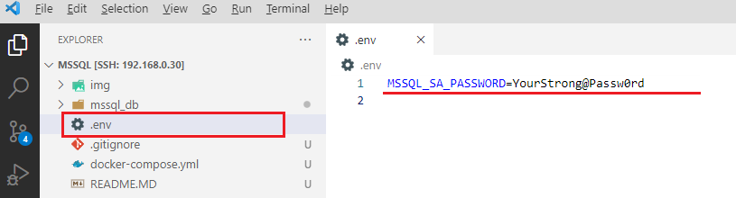

# Description

This project allows you to deploy MS SQL Server 2017 in Docker.
Based on image: mcr.microsoft.com/mssql/server:2017-latest
Details [links](https://learn.microsoft.com/en-us/sql/linux/quickstart-install-connect-docker?view=sql-server-ver16&pivots=cs1-bash)


To get a copy of this project, you need to clone the project to your machine with the command:
```
$git clone https://github.com/lod2007/mssql.git
```

#### Credentials
In the root of the project, create a file with environment variables .env:



add the following lines to the .env file:
```
MSSQL_SA_PASSWORD=YourStrong@Passw0rd
```
 - MSSQL_SA_PASSWORD - пароль SA (Specify your own strong password that is at least eight characters and meets the SQL Server password requirements. Required setting for the SQL Server image)

#### Volumes

 - ./mssql_db/data - directory with database
 - ./mssql_db/log - log directory
 - ./mssql_db/secrets - catalog of secrets
 - ./mssql_db/back_up - directory for backups. Through this directory you can enter the database into the container.

### Running a container
```
docker-compose up -d
```

### Container inside
```
docker exec -u root -it mssql /bin/bash
```

### Setting the default Cyrillic alphabet for tables
Container inside
```
docker exec -u root -it mssql /bin/bash
```
Inside the container we try to execute:
```
useradd mssql
chmod -R 777 /var/opt/mssql
echo "Cyrillic_General_CI_AS" | /opt/mssql/bin/mssql-conf set-collation
```

## Change the system administrator password
The SA account is a system administrator on the SQL Server instance that gets created during setup. After you create your SQL Server container, the MSSQL_SA_PASSWORD environment variable you specified is discoverable by running echo $MSSQL_SA_PASSWORD in the container. For security purposes, change your SA password.

Choose a strong password to use for the SA user.

Use docker exec to run sqlcmd to change the password using Transact-SQL. In the following example, the old and new passwords are read from user input.

```
sudo docker exec -it sql1 /opt/mssql-tools/bin/sqlcmd \
-S localhost -U SA \
 -P "$(read -sp "Enter current SA password: "; echo "${REPLY}")" \
 -Q "ALTER LOGIN SA WITH PASSWORD=\"$(read -sp "Enter new SA password: "; echo "${REPLY}")\""
 ```